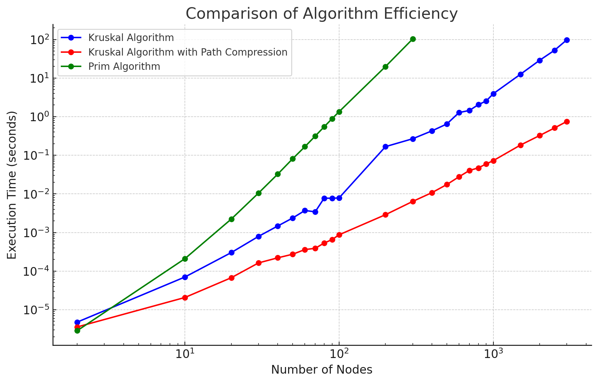

***Abstract*** \
Among 4 types of given candidate projects, the project implemented project 4, Minimum Spanning Tree algorithms. The key part of the implementation which belongs to the `programming_asignment/algorithms` module only used Python without any packages and libraries. The project included Kruskal and Prim algorithms, the well-known algorithms for finding the minimum spanning tree from a given graph. Although the initial implementation of Kruskal algorithm succeeded to find the minimum spanning tree, the paper introduced the optimized method for the algorithm which clearly surpassed the initial implementation in terms of the number of iterations and the time complexity. A Graphical User Interface was also included in the project to visualize the results of the implemented algorithms.

### I. INTRODUCTION

$\quad$ As an emergence of the Internet, a vast new market, emerged accelerating the interconnection of people and businesses globally and fostering substial economic growth. This era made Computer Networks, the foundational concept of the Internet, into a core part of Computer Science. Graph theory has become a crucial tool in representing and analyzing these networks, with the Minimum Spanning Tree (MST) being one of the significant topics within the domain. The MST represents a subgraph that connects all vertices in a given graph with no cycles and the smallest possible total edge weight, making it valuable in optimizing various network design and routing problems.

$\quad$ Prim and Kruskal algorithms are two fundamental methods to find the MST in a connected, weighted, and undirected graph [[1](#mjx-eqn-1)]. Both of them are categorized greedy algorithms, meaning that they build the MST step by step with the best choice at each step. Nevertheless, they have different strategies, leading to different time complexities and performance considerations in applications of Computer Networks. The paper explored both algorithms, implementing them from scratch using Python without any packages and libraries and comparing their performance in terms of the number of iterations and the time complexity.

$\quad$ In addition, the project included a Graphical User Interface (GUI) built with PyScript [[3](#mjx-eqn-3)], a comparatively new tool that brings Python to web browser, allowing users to interact with the Python implemented algorithms and visualize the MST algorithms' results.

$\quad$ In conclusion, the project enhanced my knowledge in terms of the following aspects: 1) Implementing both data structures of the graph and disjoint set and the algorithms of Kruskal and Prim from scratch in Python, my familarity with the Python programming language was improved, 2) Developing the GUI interface using PyScript, which was first-released in 2022, my ability to read official documents and to understand the new technology was enhanced for it barely had other references, and 3) My grasp of a graph theory was deepened by implementing the MST algorithms.

### II. DESIGN

#### A. Algorithm

$\quad$ Following the project instruction, the project did not utilize any packages and libraries for the main algorithms. Besides the development of the basic Kruskal and Prim algorithms, the project showed the optimized Kruskal algorithm.

**Kruskal Algorithm** $\quad$ In order to find the MST from a given graph, the Kruskal algorithm sorts all edges in ascending order and adds the edge to the tree if it does not create a cycle. The algorithm stops when the number of edges in the tree is equal to the number of nodes minus one. The code is in the `programming_assignment/algorithms/kruskal.py` file and the following is the pseudocode of the Kruskal algorithm.

``` plaintext
FUNCTION kruskal_algorithm(graph):
    edges = Copy graph edges
    sorted_edges = Edges sorted by weight in ascending order
    V = Number of nodes in the graph

    mst = New Graph initialized with the same nodes as input graph

    FOR each edge in sorted_edges:
        IF mst already has V - 1 edges:
            BREAK (mst is complete)

        IF adding edge to mst does not form a cycle:
            Add edge to mst

    RETURN mst
```

**Prim Algorithm** $\quad$ While the Kruskal tackles all edges in the graph to sort them in ascending order, the Prim algorithm starts from a random node and expands a tree by greedily selecting the minimum weight edge among edges connected to the current tree. Same as the Kruskal algorithm, Prim stops when the number of edges in the tree is equal to the number of nodes minus one. The code is in the `programming_assignment/algorithms/prim.py` file and the following is the pseudocode of the Prim algorithm.

``` plaintext
FUNCTION prim_algorithm(graph):
    unreached_nodes = Copy of all nodes in the graph
    edges = Copy of all edges in the graph
    mst_edges = Empty list to store edges in MST
    reached_nodes = Empty list to store nodes already in MST

    reached_node = First node in unreached_nodes
    Add reached_node to reached_nodes

    WHILE the number of reached_nodes is less than the number of unreached_nodes:
        candidate_edges = Empty list to store edges that can expand MST

        FOR each edge in edges:
            node1, node2, weight = edge

            FOR each visited_node in reached_nodes:
                IF visited_node is in (node1, node2):
                    IF both node1 and node2 are in reached_nodes:
                        CONTINUE (skip this edge)

                    ADD edge to candidate_edges

        min_edge = edge with minimum weight from candidate_edges
        ADD min_edge to mst_edges

        reached_node = The node in min_edge that is not already in reached_nodes
        ADD reached_node to reached_nodes

    mst_graph = New Graph with reached_nodes and mst_edges

    RETURN mst_graph
```

**Optimized Kruskal Algorithm** $\quad$ The Kruskal algorithm was optimized by utilizing the disjoint set. The disjoint set data structure is a data structure that stores trees of disjoint sets. The key point of the data structure is that it could find the set of a given element and merge two sets in $O(1)$ time complexity when the path compression technique is applied. The optimized Kruskal algorithm employed the disjoint set data structure to find the cycle of each subtree and to check whether the current minimum edge creates a cycle or not. The code is in the `programming_assignment/algorithms/kruskal.py` file and the following is the pseudocode of the optimized Kruskal algorithm.

``` plaintext
FUNCTION kruskal_algorithm_with_path_compression(graph):
    edges = Copy graph edges
    sorted_edges = Edges sorted by weight in ascending order
    V = Number of nodes in the graph

    mst = New Graph initialized with the same nodes as input graph
    disjoint_set = New DisjointSet initialized with graph nodes

    FOR each edge in sorted_edges:
        IF mst already has V - 1 edges:
            BREAK (mst is complete)

        root1 = Find the set of the first node in edge using disjoint_set
        root2 = Find the set of the second node in edge using disjoint_set

        IF root1 and root2 are in different sets:
            Add edge to mst
            Union the sets of the two nodes in edge

    RETURN mst
```

#### B. Test

$\quad$ The pytest [[2](#mjx-eqn-2)] framework is a testing framework used in many projects so that the framework was adopted to enable the test automation for the project. Furthermore, the networkx [[5](#mjx-eqn-5)] package generated random graphs and to check the correctness of the implemented algorithms by comparing the results with the networkx's MST.

$\quad$ All implemented algorithms and GUI were tested on MacOS 15.1 and Ubuntu 22.04 with several Python versions (3.11, 3.12, 3.13). The test ran on both local computers and GitHub Actions. The test code was placed in the `programming_assignment/tests` directory and yml files for GitHub Actions was defined in the `.github/workflows` directory.

#### C. Graphic User Interface

$\quad$ Web applications have benefits of cross-platform, easy deployment, and cost-effective for both developers and users. Normally, HTML, CSS, and JavaScript are the components of the web client application. However, the project used Python to implement the GUI to run designed algorithms and to visualize the results. Specifically, PyScript ran the Python code on the web browser as well as matplotlib [[4](#mjx-eqn-4)] visualized the results.

 \
$\text{Fig. 1. System Architecture}$

### III. IMPLEMENTATION

$\quad$ All codes were developed in the `programming_assignment` repository, following the black [[6](#mjx-eqn-6)] linting style for the Python scripts. A module, `algorithms`, contained the main algorithms, and a folder, `demo`, included the GUI implementation.

#### A. Numeric Results

$\quad$ Numerical results were obtained on the Ubuntu 22.04 with Python 3.13.0 machine which installed Intel I5-10400F CPU and 64GB RAM (as well as 20GB Swap). The experiment was conducted by `programming_assignment/evaluation.py` script. The evaluation script was designed to compare the performance of the Kruskal, Prim, and optimized Kruskal algorithms. Initially, the script had generated random graphs with the number of vertices and edges, and then evaluated the algorithms at once.

$\quad$ However, it was hard to randomly create that a graph is connected since the number of edges increases exponentially as the number of vertices increases. In other words, the probability that a graph is connected becomes lower as the number of nodes grows so that the evaluation script spent a lot of time to generate a connected graph in each execution. To solve this problem, the evaluation script was divided into two parts: the first part randomly generated connected graphs and stored them in the `programming_assignment/data` directory, and the second part read the generated graphs and evaluated the algorithms. These parts were handled by the `--generate` option. Additionally, generated graphs were limited to complete graphs to ensure that the graphs were connected and to maximize the computation in each graph.

$\quad$ The following plots showed the consumed time of the algorithms for the generated graphs. The number of vertices ranged from 2 to 10000. From the first plot, it was observed that the Kruskal algorithm was faster than the Prim algorithm as well as the optimized Kruskal algorithm significantly outperformed the initial Kruskal algorithm implementation which performed without disjoint set data structure. The second plot exclusively presented the performance of the optimized Kruskal algorithm that both the execution time and the number of vertices grew exponentially.

|||
|:---:|:---:|
|Algorithms Comparison|Optimized Kruskal Algorithm|
$\text{Fig. 2. Performance of Algorithms}$

$\quad$ The generated graphs used in the experiment were zip-compressed to share, but exceeded the file size limit of GitHub. Therefore, the zip file was uploaded to OneDrive, a public storage cloud service, and the download link was provided in the *APPENDIX* section.

#### B. Demo

$\quad$ The figure 3 presented the usage of the GUI interface which implemented in the project. At foremost, the user met the main page which showed the options to select the number of vertices and edges. In the next step, if the user clicked the "Generate" button, the graph would be generated using the optimized Kruskal and Prim algorithm. In step 3 and 4, the fact that the results of two algorithms, Kruskal and Prim, were identical was able to observe. The demo site was published on GitHub Pages so that anyone could access it with any devices using the link in the *APPENDIX* section.

|||||
|:---:|:---:|:---:|:---:|
|Step 1|Step 2|Step 3|Step 4|
$\text{Fig. 3. Site Story Simulation}$

### IV. CONCLUSION

$\quad$ The paper concluded that Prim is slower than Kruskal in the condition of the project, since although the optimized Kruskal algorithm used a path compression technique which makes the time complexity $O(1)$ as well as the Kruskal algorithm sorted edges only once $O(n \log n)$, the Prim algorithm did not use any optimization technique and sorted edges in each loop. In addition to this result, the optimized Kruskal algorithm definitely outperformed the pure Kruskal algorithm. The optimized Kruskal algorithm became consequently the best algorithm among the implemented algorithms. Comparing three algorithms in terms of the number of input sizes and the time complexity, the paper successfully reviewed the given project which implemented Kruskal and Prim algorithms for finding the MST from a given graph as well as its GUI interface for the detailed demonstration.

### REFERENCES

$$\tag*{}\label{1} \text{[1] Debmalya Panigrahi, COMPSCI 330: Design and Analysis of Algorithms, "Minimum Spanning Tree", Mar. 1st, 2016, }\\ \text{https://courses.cs.duke.edu/spring18/compsci330/Notes/mst.pdf, accessed in Nov. 2th, 2024}$$
$$\tag*{}\label{2} \text{[2] pytest, "pytest: helps you write better programs", https://docs.pytest.org/en/stable/, accessed in Nov. 2th, 2024}$$
$$\tag*{}\label{3} \text{[3] PyScript, "<py>", https://pyscript.net, accessed in Nov. 2th, 2024}$$
$$\tag*{}\label{4} \text{[4] matplotlib, "Matplotlib: Visualization with Python", https://matplotlib.org, accessed in Nov. 2th, 2024}$$
$$\tag*{}\label{5} \text{[5] networkx, "NetworkX: Network Analysis in Python", https://networkx.org, accessed in Nov. 4th, 2024}$$
$$\tag*{}\label{6} \text{[6] Black, "Black: The uncompromising Python code formatter", GitHub Repository, https://github.com/psf/black, }\\ \text{accessed in Nov. 5th, 2024}$$

### APPENDIX

* Demo - [html](https://dev-onejun.github.io/CSE-5311/programming_assignment/demo)
* Report - [pdf](https://dev-onejun.github.io/CSE-5311/papers/programming_assignment_1.pdf), [html](https://dev-onejun.github.io/CSE-5311/papers/programming_assignment_1.html)
* Data - [download](https://1drv.ms/u/s!Ak9f7WgKWrGQi7ZC733bgsMzqhZUCA?e=tJGwba)
