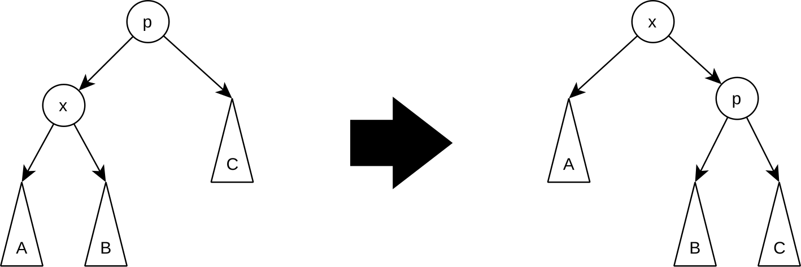
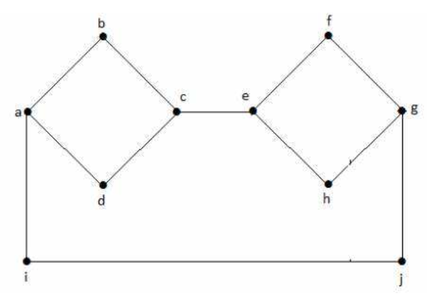
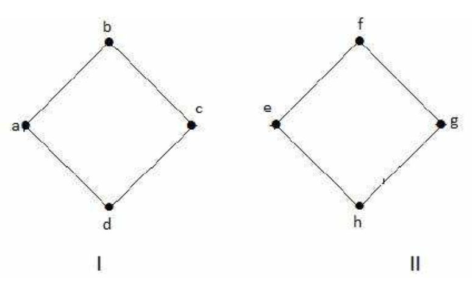

### I. Introduction

### II. Literature Review

#### A. Basic Definition in Algorithms

##### Big O Notation

*Big O Notation* represents how long an algorithm takes time to run, enabling to predict the performance as the input gets arbitrarily large. The rules of *Big O Notation* are that **1)** drop the constant (ex. $O(1 + {n \over 2} + 100 \to O(n)$), **2)** drop less significant terms (ex. $O(n + n^2) \to O(n^2)$), and **3)** usually talks about the worst case. $\text{Fig 1}$ is the comparison of the complexity among all types of *Big O Notation*.

$$
\underrightarrow{\ \ \ \ \ \ \ \ \ \ \ \ \ \ \ \ \ \ \ \ \ \ \ \ \ \ \ \ \ \ \ \ \ \ \ \ \ \ \ \ \ \ \ \ \ \ \ \ \ \ \ \ \ \ \ \ \ \ \ \ \ \ \ \ \ \ \ \ \ \ \ \ \ \ \ \ \ \ \ \ Complexity\ \ \ \ \ \ \ \ \ \ \ \ \ \ \ \ \ \ \ \ \ \ \ \ \ \ \ \ \ \ \ \ \ \ \ \ \ \ \ \ \ \ \ \ \ \ \ \ \ \ \ \ \ \ \ \ \ \ \ \ \ \ \ \ \ \ \ \ \ \ \ \ \ \ \ \ \ \ \ \ } \\
\begin{array}{cccccccc}
O(1) & O(\log{N}) & O(N) & O(N \log{N}) & O(N^2) & O(N^3) & O(2^N) & O(N!) \\
Constant & Logarithmic & Linear & N \times \log{N} & Quadratic & Cubic & Exponential & Factorial
\end{array}
$$

$\text{Fig 1. The Complexity of Big O Notation}$

This relationship between the original function $T(n)$ and the function in *Big O Notation* $F(n)$ is referred as $C \times F(n)$ is asymptotically bigger than $T(n)$ [[1](#mjx-eqn-1), [2](#mjx-eqn-2)]. The relationship derives to the formal definition of *Big O Notation*. The formal definition of *Big O Notation* is that there are variables constant $C$ and $n$ where $n \ge n_0$, which are met the formula $T(n) \le C \times F(n)$ for the notation of $T(n) = O(F(n))$. Take $T(n) = 3n^2 + 4$ for example. The *Big O Notation* of $T(n)$ is $O(n^2)$ so that $F(n)$ becomes $n^2$. Are there any variables of $C$ and $n$ which satisfy the formula $T(n) \le C \times F(n)$? The smallest $C$ which may meet the requirement is 4. With the derived formula $3n^2 + 4 \le 4 \times n^2$, the smallest $n$ which meet the formula is 2. After 2, the formula is always true.

For wrapping up, these steps are explained as three steps: **1)** Find $F(n)$ as transforming the given function $T(n)$ with *Big O Notation*. **2)** Find the smallest $C$ which may meets the propotional expression $T(n) \le C \times F(n)$. **3)** Find the smallest $n$ which satisfies the requirement.

In summary, when the formula is given in the form of $T(n) = O(L(n))$, the comparision, $T(n) \leq c \cdot L(n)$, is always true if both a constant $c$ and a value $n$, which is larger than $n_0$, are exist.

The following python code shows *Time Complexity* of each function with *Big O Notation*.

``` python
def print_first_item(items): # O(1): Order of one. Constant.
    print(item[0])

def print_all_items(items): # O(n): Order of n. Linear time.
    for item in items:
        print(item)

def print_all_possible_pairs(items): # O(n^2): Order of n square. Quadratic time.
    for item_a in items:
        for item_b in items:
            print(item_a, item_b)

def is_contain(haystack, needle): # Best: O(1), Worst: O(n) | -> O(n)
    for item in haystack:
        if needle == item:
            return True
    return False
```

*Space Complexity* also uses *Big O Notation* to express the complexity. Two functions below present their space complexity as one does not allocate any memory and the other stores $n$ variables in `hi_list`.

``` python
def say_hi_n_times(n): # Space Complexity: O(1)
    for time in range(n):
        print('hi')

def list_of_hi_n_times(n): # Space Complexity: O(n)
    hi_list = []
    for time in range(n):
        hi_list.append(time)
```

In summary, *Time complexity* refers to time cost of algorithms and *Space Complexity* talks about memory cost.

##### Big-$\theta$ (Theta) Notation

Big-$\theta$ notation describes the upper and lower bounds of the complexity of an algorithm. In other words, the notation describes the tight bound of the complexity. Likewise **Big-O Notation**, the notation **1)** drop the constant, **2)** drop the low order term, and **3)** is defined as asymptotically. To be specific for **3)**, after the specific value $n_0$, the running time of the algorithm is always between two functions $c_1 \cdot L(n)$ and $c_2 \cdot L(n)$.

##### Big-$\Omega$ (Omega) Notation

Big-$\Omega$ notation describes the lower bound of the complexity of an algorithm, without providing an upper bound. In other words, the notation refers to the best case of the complexity. Likewise **Big-O Notation**, the notation **1)** drop the constant, **2)** drop the low order term, and **3)** is defined as asymptotically.

#### B. Array - Data Structure

Typically, *Array* refers to fixed in size data structure that stores elements of the same data type. While the strengths of arrays are that **1)** they are fast to access their elements, **2)** they are fast to append elements to the end of the array, the weakness are that **1)** they are fixed in size and **2)** they have cost to insert or delete elements. $\text{Table 1}$ shows the time complexity in the worst case of each operation.

$$
\text{Table 1. Time Complexity of Array Data Structure} \\
\begin{array}{|c|c|c|c|c|c|c|}
\hline
& \text{lookup} & \text{append} & \text{insert} & \text{delete} & \text{extend} & \text{slice} \\
\hline
\text{Worst Case} & O(1) & O(1) & O(n) & O(n) & O(n) & O(n) \\
\hline
\end{array}
$$

*Insert* is a operation that inserts an element at a specific index in the array so that everything starting at that index is shifted to the right. Therefore, the worst case of the operation becomes $O(n)$ in the beginning of the array. *Delete* needs to shift all elements to the left after the element is deleted. In other words, the worst case of the operation is $O(n)$ when the targeted element is the beginning of the array. *Extend* is a operation that appends all elements of another array to the end of the targeted array. The time complexity of the operation is $O(n)$ since the operation requires to copy all elements of the other array to the targeted array. Specifically, $n$, in the *Extend* operation, is the number of elements in the other array. *Slice* is a operation that returns a subarray of the targeted array. The algorithm of the opreation is **1)** to create a new array, **2)** to copy targeted elements to the new array. The time complexity of the operation is $O(n)$ because the operation entails to copy all elements of the subarray. To be specific, $n$, in the *Slice* operation, is the number of elements in the subarray.

*In-Place Algorithms* refer to algorithms that do not require extra space to store the result of the algorithm. In other words, they do not copy the input array during its operation so that the access to the original array is not guranteed after the end of the algorithms. The algorithms are efficient in terms of space complexity. However, sometimes the algorithms are inefficient in terms of time complexity.

#### C. Dynamic Array

*Dynamic Array* is a data structure that is similar to *Array* but it is not fixed in size. Three strengths, **1)** fast to access elements, **2)** flexible in size, and **3)** friendly to be cached, and two weaknesses, **1)** slow at the worst case of append operation and **2)** more cost to insert and delete elements. $\text{Table 2}$ shows the time complexity in both the average case and the worst case of each operation.

$$
\text{Table 2. Time Complexity of Dynamic Array Data Structure} \\
\begin{array}{|c|c|c|c|c|c|c|}
\hline
& \text{lookup} & \text{append} & \text{insert} & \text{delete} \\
\hline
\text{Average Case} & O(1) & O(1) & O(n) & O(n) \\
\hline
\text{Worst Case} & O(1) & O(n) & O(n) & O(n) \\
\hline
\end{array}
$$

#### D. Searching Algorithms

What *Searching Algorithms* conduct is to find a target $x$, and return its index if the target were in arrays or databases, or return False if not. **Linear Search** is the simplest algorithm to search the target, suitable for short lists. **Binary Search** needs to be conducted on a sorted list, and it is faster than the linear search. The algorithm is the popular algorithm for large databases with records sorted by numerical values. Pseudo code of the algorithms is shown below.

``` python
def binary_serach(list, min, max, key):
    while min <= max:
        mid = (min + max) // 2

        if list[mid] > key:
            max = mid - 1
        elif list[mid] < key:
            min = mid + 1
        else:
            return mid

    return False
```

With the step of Binary Search, the time complexity of the algorithm $O(\log{n})$ is derived. The algorithm is efficient in terms of time complexity, but it requires the list to be sorted. The algorithm is not suitable for the unsorted list.

#### E. Sorting Algorithms

*Sorting Algorithms* are algorithms that sort the elements in the list in ascending or descending order. **1) Insertion Sort** is a simple algorithm that sorts the list by inserting the elements one by one. The algorithm sequentially pick a `key` and compare the `key` from the adjacent previous elements to the first element, inserting the `key` if the `key` is smaller than the element. In other words, in $n = k$ iteration, the algorithm picks the $k$th element and compares the element with the sorted subarray from the first element to the $k-1$th element to insert the $k$th element to the suited index. The rest of the array is unsorted. The best case is $O(n)$ when the list is already sorted, and the worst case is $O(n^2)$ when the list is sorted in reverse order. The algorithm is in-place algorithm which makes the list sorted without extra space. Pseudo code of the algorithm is

``` python
def insertion_sort(list):
    for i in range(1, len(list)):
        key = list[i]

        j = i - 1
        while j >= 0 and key < list[j]:
            list[j + 1] = list[j]
            j -= 1
        list[j + 1] = key
```

**2) Merge Sort** is a divide-and-conquer algorithm that divides the list into two halves, sorts the two halves, and merges the two halves. The algorithm is efficient in terms of time complexity, $O(n \log{n})$, than the Insertion Sort. Yet, the algorithm is inefficient in terms of space complexity due to its out-of-place feature. Pseudo code of the algorithm [[3](#mjx-eqn-3)] is

``` python
def merge(arr, left, mid, right):
    n1 = mid - left + 1
    n2 = right - mid

    # Create temp arrays
    L = [0] * n1
    R = [0] * n2

    # Copy data to temp arrays L[] and R[]
    for i in range(n1):
        L[i] = arr[left + i]
    for j in range(n2):
        R[j] = arr[mid + 1 + j]

    i = 0  # Initial index of first subarray
    j = 0  # Initial index of second subarray
    k = left  # Initial index of merged subarray

    # Merge the temp arrays back
    # into arr[left..right]
    while i < n1 and j < n2:
        if L[i] <= R[j]:
            arr[k] = L[i]
            i += 1
        else:
            arr[k] = R[j]
            j += 1
        k += 1

    # Copy the remaining elements of L[],
    # if there are any
    while i < n1:
        arr[k] = L[i]
        i += 1
        k += 1

    # Copy the remaining elements of R[],
    # if there are any
    while j < n2:
        arr[k] = R[j]
        j += 1
        k += 1

def merge_sort(arr, left, right):
    if left < right:
        mid = (left + right) // 2

        merge_sort(arr, left, mid)
        merge_sort(arr, mid + 1, right)
        merge(arr, left, mid, right)
```

**3) Selection Sort** is a simple algorithm that sorts the list by selecting an index and searching the suited element in the index. In other words, the algorithm selects the smallest element in each iteration with the partial list and inserts the element to the index. The difference from the Insertion Sort is that the Insertion Sort inserts an element to suited index with the already sorted list. $(O(n^2))$ is the time complexity of the algorithm. In terms of space complexity, the algorithm is in-place algorithm. Pseudo code of the algorithm is

``` python
Selection Sort(list, n)
    for i = 0 to n - 1
        min_index = i
        for j = i + 1 to n
            if list[j] < list[min_index]
                min_index = j
        swap(list[i], list[min_index])
    return list
```

In summary, at the best case, the runtime comparison of the algorithms is insertion ($O(n)$) $\lt$ merge ($O(n\log n)$ $\lt$ selection ($O(n^2)$). At the worst case, the fastest algorithms is merge ($O(n\log n)$).

(For the exam, do not need to memorize Pseudo code. Just memorize how each algorithm works.)

**4) Bubble Sort**

**Bubble sort** is to compare adjacent elements and swap them if they are in the wrong order. The algorithm repeats the process until no swaps are needed. The time complexity of the bubble sort algorithm is $O(n^2)$. The algorithm is an in-place sorting algorithm.

```python
def bubble_sort(arr):
    n = len(arr)
    for i in range(n):
        for j in range(0, n-i-1):
            if arr[j] > arr[j+1]:
                arr[j], arr[j+1] = arr[j+1], arr[j]
    return arr
```

**5) Quick Sort**

**Quick sort** is adopted from the divide-and-conquer approach. The algorithm selects a pivot element and partitions the array into two sub-arrays where elements less than the pivot are on the left array and elements greater than the pivot are on the right array, repeating the process recursively for each sub-array until the array is sorted. A pivot is recursived selected in the left array at first, and then in the right array. When the sub-arrays have only one element or are empty, they are considered sorted. The pivot element is picked from the first, last, or random element of the array. The time complexity of the quick sort algorithm is $O(n \log n)$ in the best and average cases, and $O(n^2)$ in the worst case when the array is already sorted and the pivot is always the smallest or largest element. The algorithm is an in-place algorithm.

```python
def quick_sort(arr, low, high):
    if low < high:
        adjusted_pivot_index = partition(arr, low, high)
        quick_sort(arr, low, pi-1)
        quick_sort(arr, pi+1, high)
    return arr

def partition(arr, low, high):
    pivot = arr[high] # use the last element as the pivot
    i = low - 1 # guarantee a proper initial state that all elements before i are less than the pivot
    for j in range(low, high): # after the loop, all elements before i are less than the pivot
        if arr[j] < pivot:
            i += 1
            arr[i], arr[j] = arr[j], arr[i]
    arr[i+1], arr[high] = arr[high], arr[i+1] # swap the pivot with the element at i+1 since only i elements are less than the pivot. As a result, the range [low, i] is sorted.
    return i+1
```

**Three-way Quick Sort Algorithm** is a variation of the quick sort algorithm that particularly effective when the array contains many duplicate elements by minimizing unnecessary comparisions and swaps of duplicate elements. The key idea is that, instead of partitioning the array into two sub-arrays, the algorithm partitions the array into three parts: elements less than the pivot, element equal to the pivot, and elements greater than the pivot. Recursively splitting the 'less than' and 'greater than' parts into three sub-arrays, the algorithm sorts the array with the already sorted 'equal to' part. The time complexity of the three-way quick sort algorithm is still $O(n \log n)$ in the best and average cases, and $O(n^2)$ in the worst case. The algorithm is an in-place algorithm.

```python
def three_way_quicksort(arr, low, high):
    if low >= high:
        return

    lt, gt = partition(arr, low, high)
    three_way_quicksort(arr, low, lt-1)
    three_way_quicksort(arr, gt+1, high)

def partition(arr, low, high):
    pivot = arr[low]
    lt, gt = low, high
    i = low
    while i <= gt:
        if arr[i] < pivot:
            arr[lt], arr[i] = arr[i], arr[lt]
            lt += 1
            i += 1
        elif arr[i] > pivot:
            arr[gt], arr[i] = arr[i], arr[gt]
            gt -= 1
        else:
            i += 1
    return lt, gt
```

**Median-of-Three Quick Sort Algorithm** is another variation of the quick sort algorithm that aims to improve the performance of the quick sort algorithm and to reduce the likelihood of the worst-case scenarios by strategically selecting the pivot element. Instead of choosing the first, last, or random element as the pivot, the algorithm selects the median among the three elements: the first, middle, and last elements of the array, as the pivot. The partition function is the same as the classic quick sort algorithm. Although the strategy is effective, the time complexity of the median-of-three quick sort algorithm is still $O(n^2)$ in the worst case and $O(n \log n)$ in the best and average cases. The algorithm is an in-place algorithm.

```python
def median_of_three_quicksort(arr, low, high):
    if low < high:
        pivot_index = median_of_three(arr, low, high)
        arr[pivot_index], arr[high] = arr[high], arr[pivot_index]

        adjusted_pivot_index = partition(arr, low, high) # Same partition function as the classic quick sort algorithm
        median_of_three_quicksort(arr, low, adjusted_pivot_index-1)
        median_of_three_quicksort(arr, adjusted_pivot_index+1, high)

def median_of_three(arr, low, high):
    mid = (low + high) // 2

    if arr[low] > arr[mid]:
        arr[low], arr[mid] = arr[mid], arr[low]
    if arr[low] > arr[high]:
        arr[low], arr[high] = arr[high], arr[low]
    if arr[mid] > arr[high]:
        arr[mid], arr[high] = arr[high], arr[mid]

    return mid
```

**$K$-th Smallest Element Problem**

**Quick Select Algorithm** is the other variation of the quick sort algorithm that aims to find the kth smallest element in an unsorted array. The situation, called **the kth smallest element problem** or **the linear selection problem**, has four approaches: **(1) Sort the array using the merge(quick) sort**. The kth smallest element can be found in $O(n \log n)$ time complexity with constant access time. **(2) Find the smallest element in each iteration**. In order to find the smallest element in the array, $O(n)$ time complexity is required. The approach repeats the process k times to find the kth smallest element so that the approach is efficient only when k is small. As a result, $O(n \cdot k)$ is required. **(3) Quick Select Algorithm** works by selecting a pivot, partitioning the array, and then determining if the kth smallest element is in the left, right partition, or the pivot itself, repeating the process until finding the kth smallest element rather than sorting the entire array. This approach has a $O(n)$ time complexity in the best and average cases better than the $O(n \log n)$ time complexity of the merge sort algorithm. However, similar to the quick sort algorithm, the quick select algorithm has a $O(n^2)$ time complexity in the worst case when the pivot is consistently the smallest or largest element in the sorted array. (Since the problem is in the situation where the array is unsorted, the worst-case scenario is less likely to occur.)

```python
def quick_select(arr, low, high, k):
    if low <= high:
        adjusted_pivot_index = partition(arr, low, high)

        if adjusted_pivot_index == k - 1:
            return arr[adjusted_pivot_index]
        elif adjusted_pivot_index > k - 1: # The kth smallest element is in the left sub-array
            return quick_select(arr, low, adjusted_pivot_index - 1, k)
        else: # The kth smallest element is in the right sub-array
            return quick_select(arr, adjusted_pivot_index + 1, high, k)

    return None

def partition(arr, low, high):
    pivot = arr[high]
    i = low
    for j in range(low, high):
        if arr[j] <= pivot:
            arr[i], arr[j] = arr[j], arr[i]
            i += 1
    arr[i], arr[high] = arr[high], arr[i]
    return i
```

**(4) Median of Medians Algorithm**, also known as **Deterministic Linear Time Selection Algorithm**, is notable for achieving $O(n)$ time complexity for finding the k-th smallest element in an unsorted array. The algorithm is based on the divide-and-conquer strategy. The algorithm is as follows: **0)** if the number of arrays $n$ is less than or equal to 5, sort the array and return the k-th smallest element. **1)** Divide the array into groups of 5 elements. **2)** Find the median of each group consisted of 5 elements by sorting the each group. **3)** Among the medians of each group, find the medians of the medians. **4)** Use the median of medians as a pivot to partition the array into elements smaller than the pivot and elements greater than the pivot. **5)** Check if the pivot is the k-th smallest element. If true, return the pivot. If false, recursively find the k-th smallest element in the left or right partition.

```python
def median_of_medians(arr, k):
    if len(arr) <= 5:
        return sorted(arr)[k - 1]

    # Divide the array into groups of 5 elements
    groups = [sorted(arr[i:i+5]) for i in range(0, len(arr), 5)]
    medians = [group[len(group) // 2] for group in groups]

    # Find the median of medians
    pivot = median_of_medians(medians, len(medians) // 2)

    # Partition the array into two parts
    low = [x for x in arr if x < pivot]
    high = [x for x in arr if x > pivot]

    # Recursively find the k-th smallest element, determining the rank of the pivot
    if k <= len(low):
        return median_of_medians(low, k)
    elif k > len(arr) - len(high):
        return median_of_medians(high, k - (len(arr) - len(high)))
    else:
        return pivot
```

Time complexity of the Median of Medians Algorithm is analyzed as follows: **1)** Sorting each group of 5 elements to find the median takes $O(5 \times \frac{n}{5}) = O(n)$. **2)** Finding the median of the medians takes $O(\frac{n}{5})$. **3)** Since the pivot is guaranteed to be a good pivot, at least 30% of the elements are less than the pivot and at least another 30% of the elements are greater than the pivot, the recursion occurs on at most 70% of the elements. Therefore,

$$
T(n) = n + T(\frac{n}{5}) + T(\frac{7n}{10}) \\
\to O(n) = n
$$

In summary, the comparison among algorithms which can be used in sorting is in the table below.

$$
\begin{array}{|c|c|c|c|c|c|}
\hline
\text{Algorithm} & \text{Best Case} & \text{Average Case} & \text{Worst Case} \\
\hline
\text{Insertion Sort} & O(n) & O(n^2) & O(n^2) \\
\text{Merge Sort} & O(n \log n) & O(n \log n) & O(n \log n) \\
\text{Selection Sort} & O(n^2) & O(n^2) & O(n^2) \\
\text{Bubble Sort} & O(n) & O(n^2) & O(n^2) \\
\text{Quick Sort} & O(n \log n) & O(n \log n) & O(n^2) \\
\text{Three-way Quick Sort} & O(n \log n) & O(n \log n) & O(n^2) \\
\text{Median-of-Three Quick Sort} & O(n \log n) & O(n \log n) & O(n^2) \\
\text{Quick Select} & O(n \log n) & O(n \log n) & O(n^2) \\
\text{Median of Medians} & O(n \log n) & O(n \log n) & O(n \log n) \\
\hline
\end{array}
$$

#### F. Inversion Count Problem

An inversion refers to a state when a sequence of numbers is not in the usual order of whole arrays, either ascending or descending order. The Inversion Count Problem is to find the number of inversions in an array. For example, the sequence {2, 4, 1, 3, 5} has three inversions: (2, 1), (4, 1), (4, 3) among 10 possible pairs where ($a$, $b$) denotes that $a$ is before $b$ in the sequences. Technically, if $i < j$ and $A[i] > A[j]$, then the pair ($i$, $j$) is an inversion of the array $A$.

To tackle this problem, Five approaches are introduced: **1. Brute Force (Naive and Simple Approach)** - Comparing all pairs of elements in the array, count the number of inversions. The approach has a $O(n^2)$ time complexity. **2. Merge Sort Algorithm (Divide and Conquer Approach)** - During sorting the array with the merge sort algorithm, count the number of inversions. The approach has a $O(n \log n)$ time complexity same as the merge sort algorithm. **3. Bubble Sort Algorithm** - Count the number of inversions while sorting the array with the bubble sort algorithm. While the approach has a $O(n^2)$ time complexity in the worst case when the array is sorted in reverse order, $O(n)$ time complexity in the best case when the array is already sorted. **4. Quick Sort Algorithm (Divide and Conquer Approach)** - Count the number of inversions while sorting the array with the quick sort algorithm. The approach has a $O(n \log n)$ time complexity.

#### G. Tree Data Structure

Tree is a data structure that consists of nodes with a parent and child relationship. The top node is called the root of the tree, and the nodes that have no children are called leaf nodes. The path is a sequence of nodes from the root to a target node. Visiting a node means checking the value of the node, and traversing a tree means passing through the nodes in a specific order. Keys are the values stored in the nodes.

The depth of a node is the length of the path from the root to the node. The depth of the root is 0. The level of a node is the depth of the node plus one ($\text{level} = \text{depth} + 1$). The height of the root will be given in a problem condition, whether the height of the root is 0 or 1. The height of the tree is the maximum depth of the tree ($\text{height} = \max(\text{depth})$). In other words, the height of the tree is the longest path from the root to a leaf node.

Properties of the tree data structure are that \
$\quad\mathbf{\text{1)}}$ it stores data naturally in a hierarchical form. \
$\quad\mathbf{\text{2)}}$ it provides moderate access and search, quicker than linked lists but slower than arrays. \
$\quad\mathbf{\text{3)}}$ it provides moderate insertion and deletion, quicker than arrays but slower than unordered linked lists. \
$\quad\mathbf{\text{4)}}$ it does not have an upper bound on the number of nodes like linked lists and unlike arrays.

Tree Traversals are a way to visit all the nodes in a tree. Two main types of traversals are Breadth First Traversal and Depth First Traversal. **1)** Breadth First Traversal (or level order traversal) visits nodes level by level, left from right, starting from the root. Two methods to implement Breadth First Traversal (level order traversal) are: 1) using two functions which takes $O(n^2)$, and 2) using a queue which takes $O(n)$.

``` python
def print_level_order(tree):
    for d in range(1, height(tree) + 1):
        print_given_level(tree, d)

def print_given_level(tree, level):
    if tree is Null:
        return

    if level == 1: # if target node
        print(tree.data)
    elif level > 1:
        print_given_level(tree.left, level - 1)
        print_given_level(tree.right, level - 1)
```

**2)** Depth First Traversal visits all nodes in a branch, left from right, before moving to the next branch. Three types of Depth First Traversals are: Pre-order traversal, In-order traversal, and Post-order traversal. **Pre-order Traversal** visits the root, then the left subtree, then the right subtree. **In-order Traversal** visits the left subtree, then the root, then the right subtree. **Post-order Traversal** visits the left subtree, then the right subtree, then the root.

``` python
def pre_order_traversal(tree):
    if tree is Null:
        return

    print(tree.data)
    pre_order_traversal(tree.left)
    pre_order_traversal(tree.right)

def in_order_traversal(tree):
    if tree is Null:
        return

    in_order_traversal(tree.left)
    print(tree.data)
    in_order_traversal(tree.right)

def post_order_traversal(tree):
    if tree is Null:
        return

    post_order_traversal(tree.left)
    post_order_traversal(tree.right)
    print(tree.data)
```

For example, if a tree is constructed with the following nodes:

``` plaintext
        1
      /   \
     2     3
    / \   / \
   4   5 6   7
```

In-order Traversal would visit the nodes in the order: 4, 2, 5, 1, 6, 3, 7. Pre-order Traversal would visit the nodes in the order: 1, 2, 4, 5, 3, 6, 7. Post-order Traversal would visit the nodes in the order: 4, 5, 2, 6, 7, 3, 1.

**1. Binary Tree**

Binary tree is a type of tree data structure in which each node has at most two children, normally referred to as the left child and the right child. The binary tree does not have any specific order in its stored values so that $O(n)$ time complexity is taken to find the maximum, minimum, or any specific value in the binary tree by traversing all the nodes.

**2. Heap**

A **Complete Binary Tree** is a binary tree in which every level, except for the last level, is completely filled, and nodes in the last level are filled left-first to right meaning that all nodes must be as far left as possible. For example, the left tree on the below is a complete binary tree, but the right tree is not.

```plaintext
    1           1
   / \         / \
  2   3       2   3
 / \         /   /
4   5       4   5
```

A **Heap** is a complete binary tree that satisfies a property that the value of parent nodes are greater than or equal to child node values in a max heap and the value of parent nodes are less than or equal to child node values in a min heap. The root node is the maximum value in the max heap and the minimum value in the min heap. Specifically, a heap satisfies the following four properties: \
$\quad\mathbf{\text{1)}}$ The highest / lowest element is always at the root. \
$\quad\mathbf{\text{2)}}$ Nodes are partially sorted, meaning that the parent node is greater / smaller than the child nodes. (Might not related to levels) \
$\quad\mathbf{\text{3)}}$ The tree is a complete binary tree filled from left to right. \
$\quad\mathbf{\text{4)}}$ The height of the tree is $O(\log n)$.

These heaps are useful when repeatedly finding the maximum or minimum value in the data structure. The time complexity of finding the maximum or minimum value in the heap is $O(1)$ since the value is always at the root.

Heaps are represented as arrays in which a node at index $i$ has children at indices $2i$ for the left child and $2i + 1$ for the right child. The parent of the node at index $i$ is at index $\left\lfloor\frac{i}{2}\right\rfloor$. Following figure shows the array representation of a heap.

 \
$\text{Fig. 2. Heap as Array Representation}$ [[4](#mjx-eqn-4)]

In this review, the operations of a heap is covered in the perspective of a max heap. The operations that are performed on a heap are **1)** insertion, **2)** deletion, and **3)** heapify. A heap is only interested in the root so that deletion in a heap means removing the root node. Note that an inserted node is always to be compared with its parent node.

``` python
Insert(heap, value): # O(log n) time complexity (the height of the heap)
    # Append the value to the end of the heap
    heap.append(value)

    # Bubble up the new value to restore the heap property
    index = len(heap) - 1
    parent = index // 2 # assume that the root starts from the index 1

    while parent >= 1 and heap[parent] < heap[index]:
        heap[parent], heap[index] = heap[index], heap[parent]

        index = parent
        parent = index // 2

Delete(heap): # O(log n) time complexity (the height of the heap)
    if heap is empty:
        return None

    # Swap the root with the last element
    heap[1], heap[-1] = heap[-1], heap[1]
    max_value = heap.pop()

    # Bubble down the root to restore the heap property
    index = 1
    left = 2 * index
    right = 2 * index + 1

    while left < len(heap):
        child = left
        if right < len(heap) and heap[right] > heap[left]:
            child = right

        if child == index:
            break

        if heap[index] < heap[child]:
            heap[index], heap[child] = heap[child], heap[index]

        index = child
        left = 2 * index
        right = 2 * index + 1

BuildMaxHeap(heap): # O(n) time complexity (the number of the nodes)
    size = len(heap)
    for i in range(size // 2, 0, -1):
        Heapify(heap, i)

Heapify(heap, index): # O(log n) time complexity (the height of the heap)
    largest = index
    left = 2 * index
    right = 2 * index + 1

    # Check if the left child exists and is greater than the current largest
    if left < len(heap) and heap[left] > heap[largest]:
        largest = left

    # Check if the right child exists and is greater than the current largest
    if right < len(heap) and heap[right] > heap[largest]:
        largest = right

    # Swap the current node with the largest node
    if largest != index:
        heap[index], heap[largest] = heap[largest], heap[index]
        Heapify(heap, largest)
```

Heap sort is a sorting algorithm that uses a heap data structure. With the heap (regardless eitehr max heap or min heap), constructing a heap and popping the root element iteratively, the heap sort algorithm sorts the input data with $O(n \log n)$ time complexity.

**3. Disjoint Set**

A disjoint set, also known as a union-find data structure, is a data structure that stores a collection of disjoint sets, allowing for efficient merging and finding of the sets. The disjoint set data structure consists of items which store an id and a parent pointer. The pointers of the elements are arranged to form one or more trees where each tree represents a set.

 \
$\text{Fig 3. Disjoint Set}$

The operations that performed on a disjoint set are **1)** make-set, **2)** find-set, and **3)** union. The make-set operation creates a new set with a single element. The find-set operation returns the representative of the set that contains the element by following the chain of parent pointers from the target element until the element whose parent is itself (the root). The union operation merges two sets into a single set. Make-set operation shows $O(1)$ time complexity, find-set operation presents $O(n)$ time complexity, and union operation has $O(n)$ time complexity due to the find-set operations.

``` python
MakeSet(x):
    if x is not already present:
        add x to the disjoint set tree
        x.parent = x
        x.rank = 0 # Union by rank

Find(x):
    if x.parent != x:
        x.parent = Find(x.parent) # Path Compression
    return x.parent

Union(x, y):
    rootX, rootY = Find(x), Find(y)

    if rootX == rootY:
        return

    if rootX.rank < rootY.rank:
        rootX.parent = rootY
    elif rootX.rank > rootY.rank:
        rootY.parent = rootX
    else:
        rootY.parent = rootX
        rootX.rank += 1
```

In order to efficient implementation, the disjoint set uses union by rank and path compression techniques. Union by rank keeps the tree shallow by always attaching the smaller tree to the root of the larger tree. Path compression makes all elements in the path from the target element to the root point directly to the root, drastically reducing the time complexity of future find operations.

**4. Binary Search Tree (BST)**

BST is a binary tree that satisfies the following properties: \
$\quad\mathbf{\text{1)}}$ The number of children for each node is at most two. \
$\quad\mathbf{\text{2)}}$ The left subtree of a node contains only nodes with keys less than the node's key. \
$\quad\mathbf{\text{3)}}$ The right subtree of a node contains only nodes with keys greater than the node's key. \
$\quad\mathbf{\text{4)}}$ Both the left and right subtrees must also be Binary Search Trees. \
$\quad\mathbf{\text{5)}}$ Duplicate nodes are not allowed in the tree.

The operations performed on a BST are **1)** insertion, **2)** search, **3)** pre-order traversal, **4)** in-order traversal, and **5)** post-order traversal. When $h$ is the height of the tree, search(find), insertion, and deletion operations take $O(h)$ time complexity. The maximum value is the rightmost node, and the minimum value is the leftmost node in the BST. The algorithms for search and checking if the tree is a binary search tree are as follows:

``` python
Find(value, root):
    if root is empty:
        return False
    if root.value == value:
        return True
    if value < root.value:
        return Find(value, root.left)
    if value > root.value:
        return Find(value, root.right)

Insert(root, node):
    if root is empty:
        return new Node(node.value)
    if node.value == root.value:
        return root
    if node.value < root.value:
        root.left = Insert(root.left, node)
    if node.value > root.value:
        root.right = Insert(root.right, node)

CheckBST(root, min, max):
    if root is empty:
        return True
    if root.value <= min or root.value >= max:
        return False
    return CheckBST(root.left, min, root.value) and CheckBST(root.right, root.value, max)

Delete(x): O(h)
    if x is a leaf:
        remove x

    if x has one child in the left:
        m = Find the max of the left subtree
        x.data = m.data
        Delete(m) # recursively delete m

    if x has one child in the right:
        m = Find the min of the right subtree
        x.data = m.data
        Delete(m) # recursively delete m

    if x has two children:
        m = Find the max of the left subtree # or the min of the right subtree
        x.data = m.data
        Delete(m) # recursively delete m
```

However, BST is subjected to a skewed tree. For example, if the nodes are inserted in the order of 1, 2, 3, 4, 5, 6, 7, the tree would look like:

``` plaintext
        1
         \
          2
           \
            3
             \
              4
               \
                5
                 \
                  6
                   \
                    7
```

Finding medians during inserting nodes might be a solution to balance the tree.

``` python
def Repeat_Median(all_input):
    # Find the medain of the array
    M = median(all_input)

    # Partition the array into L(Smaller), M, R(Larger)
    L = all_input[0: M]
    R = all_input[M + 1: len(all_input)]

    # Create a tree
    root = M
    root.left = Repeat_Median(L)
    root.right = Repeat_Median(R)
    return root
```

Still, this proposal has limitations. Firstly, the proposal does not guarantee a balanced tree which leads the tree operations to $O(\log n)$ time complexity. The proposal might work well when the data of the tree is constant, but when it comes to dynamic data, where the content of the data keeps changing, the proposal might not work well. Secondly, the search for the median in the input array is a challenge in the cost of time complexity.

**5. AVL Tree** [Practice](#mjx-eqn-A)

To address the limitations of the BST, AVL Tree is proposed. Named after its inventors, Adelson-Velsky and Landis, the AVL Tree is a self-balancing BST where the difference between the heights of the left and right subtrees can not be more than 1 for all nodes. 1 is called as a balance factor. The AVL Tree guarantees the time complexity of $O(\log n)$ for all operations.

To preserve the definition of AVL Tree, four types of AVL rotations are used: **1)** Left Rotation, **2)** Right Rotation, **3)** Left-Right Rotation, and **4)** Right-Left Rotation.

|-768.png)||
|:--:|:--:|
|Left Rotation|Right Rotation|
|-768.png)|-768.png)|
|Left-Right Rotation|Right-Left Rotation| \\
$\text{Fig 4. Rotations in AVL Tree [} \href{#mjx-eqn-5}{\text{5}} ]$

**6. Red Black Tree** [Practice](#mjx-eqn-B)

Red Black Tree is another self-balancing BST. Although AVL Tree had successfully guaranteed the time complexity of $O(\log n)$ for all operations efficiently, its definition was so strict that the cost of maintaining the balance of the tree becomes expensive. Red Black Tree was proposed to reduce the cost with fewer rotations.

Red Black tree has one extra attribute for each node compared to BST; color (red or black). Specifically, it has following four properties. \
$\quad\text{1.}$ Every node is either red or black. \
$\quad\text{2.}$ The root node is always black. \
$\quad\text{3.}$ If a node is red, both of its children are black. \
$\quad\text{4.}$ Every path from a node to its descendant leaf nodes contains the same number of black nodes.

As a usual tree, Red Black Tree has four operations: Insert, Lookup, Remove, and Print. In this review, only Insert operation is introduced [[7](#mjx-eqn-7)]. (예전 알고리즘 노트 확인 필요)

``` plaintext
Insert Operation:
    If a tree is empty, insert the node as the root node and color it black.

    If a tree is not empty,
        1) Use the BST insert algorithm to add a new node to the tree.
        2) Color the new node as red by default.
        3) Check and restore the Red Black Tree properties (fix violations) with the following cases

            Case 1: The parent of the new node is black
                Do nothing
            Case 2: The parent of the new node is red
                Let the new node be X, the parent of X be P, the grandparent of X be G, and the uncle (another sibling of G) of X be S. The case 2 violated the 3rd property of Red Black Tree.
                    a) S is red
                        Recolor P, S, and G
                            - Color P and S as black
                            - Color G as red if G is not the root, otherwise black
                    b) S is black or Null
                        Recolor with rotation in Figure 5
```

|  |  |
$\text{Fig 5. Red Black Tree Insertion}$

**7. Splay Tree**

Splay Tree is a self-adjusting BST maintaining efficiency by moving the most recently accessed node to the root after the tree operations such as search, insert, and delete. This process helps subsequent operations to reduce the cost and be faster. Besides basic operatinos of tree, Splay Tree involves a common operation called splaying in each operations.

Splaying is a process of moving the target node to the root by performing tree rotations. **1)** Zig Rotation is a single rotation with the right to move the target node to the root. **2)** Zag Rotation is another single rotation with the left. **3)** Zig-Zig Rotation performs a double rotation with the two left or right, applied when the target node and its parent are both right children. **4)** Zig-Zag Rotation is a double rotation with the left and its followed right, applied when the target node is a right child and its parent is a left child. **5)** Zig-Zag Rotation and **6)** Zag-Zig Rotation are vice versa in the opposite direction.

||||
|:--:|:--:|:--:|
|Zig Rotation|Zig-Zig Rotation|Zag-Zig Rotation| \\
$$\text{Fig 6. Splay Tree Rotations}$$

``` python
Splay(Tree, x):
    while x is not the root:
        if x's parent is the root: # Zig case
            rotate x
        else if x and its parent are both left or both right children: Zig-Zig or Zag-Zag case
            rotate x's parent
            rotate x
        else: # Zig-Zag or Zag-Zig case
            rotate x
            rotate x

Insert(Tree, key):
    node = Basic BST Insert(T, key)
    Splay(T, node)
```

#### H. Graph Theory

A graph is $G = (V, E)$ where $V$ is a set of vertices and $E$ is a set of edges, typically denoted as $V = \{a, b, c, d, e\}$ and $E = \{ab, bd, ac, cd, de\}$ for example.

Specifically, **Vertex** is a set of nodes, **Edge** is a set of a line between two nodes, **Adjacency** refers to two nodes connected to each other through an edge or two edges connected to each other through a node, **Path** is a sequence of edges between two nodes in a graph, and **Distance** is the number of edges in the shortest path between two nodes $U$ and $V$. The **Distance** is represented as $d(U, V)$.

**Eccentricity** is the maximum distance between a vertex and all other vertices in a graph, usually denoted as $e(v) = \max(d(v, u))$.

**Degree of Vertex** is the number of vertices which are adjacent (connected). In $n$ nodes, the range of the degree is $0 \leq \text{degree} \leq n-1$. The sum of the degree of all vertices is equal to twice the number of edges, $2\mid E \mid$.

Graphs have three operations: 1) Add/Pop a vertex, 2) Add/Pop an edge, and 3) Display a vertex.

**1) Traversal Methods**

**Depth First Traversal** in a graph traverses in a depth-first manner, using a stack to remember vertices, a sequence of vertices to visit next. The algorithm is applied to find cycle, topological sorting, whether a graph is bipartite, and connected components. The complexity of DFS is $O(V + E)$ where $V$ is the number of vertices and $E$ is the number of edges, implementing as follows:

``` python
Rule 1: Visit the adjacent unvisited neighbor. 1) Mark it as visited, 2) print it, and 3) push it on a stack. (Pre-order traversal)
Rule 2: If no adjacent vertex is found, pop up a vertex from the stack.
Rule 3: Repeat rule 1 and 2 until the stack is empty.

DFS_iterative(G, s):
    let S be a stack
    S.push(s)
    mark s as visited
    while S is not empty:
        v = S.pop()
        for all neighbors w of v:
            if w is not visited:
                s.push(w)
                mark w as visited

DFS_recursive(G, s):
    mark s as visited
    for all neighbors w of s:
        if w is not visited:
            DFS_recursive(G, w)
```

**Breadth First Traversal** in a graph traverses in a breadth-first manner, using a queue to remember vertices, a sequence of vertices to visit next. The algorithm is applied to find the shortest path in a graph, MST of unweighted graph, GPS navigation, cycle in undirected graph, and all nodes within one connected component. The complexity of BFS is $O(V + E)$ where $V$ is the number of vertices and $E$ is the number of edges. The algorithm is:

``` python
Rule 1: Visit the adjacent unvisited neighbor. 1) Mark it as visited, 2) print it, and 3) push it on a queue. (Pre-order traversal)
Rule 2: If no adjacent neighbor is found, remove the first vertex from the queue.
Rule 3: Repeat rule 1 and 2 until the queue is empty.

BFS(G, s):
    let Q be a queue
    Q.push(s)
    mark s as visited
    while Q is not empty:
        v = Q.pop()
        for all neighbors w of v:
            if w is not visited:
                Q.push(w)
                mark w as visited
```

**2) Types of Graphs**

**Non-Directed Graph** is a graph where edges have no direction, meaning that the edge $(u, v)$ is the same as $(v, u)$. **Directed Graph** is a graph where edges have a direction. An arrow is usually drawn from the source vertex to the destination vertex, allowing only a shift from the source to the destination. The graph distinguishes the **Degree of Vertex** into **In-degree** and **Out-degree**. **In-degree** is the number of edges coming into a vertex, and **Out-degree** is the number of edges going out from a vertex.

**Simple Graph** refers to a graph with no loops or multiple edges between the same pair of vertices. The maximum number of edges in a simple graph is $\frac{n(n-1)}{2}$, where $n$ is the number of vertices. This is equivalent to $n C_2$, a combination of two things from $n$ things. The number of valid simple graphs with $n$ vertices is $2^{n(n-1)/2}$, derived from the perspective that each edge can be either present or absent $2$ and the number of possible maximum edges $\frac{n(n-1)}{2}$.

While a graph $G$ is **Connected** if there is a **path** (not an adjacency) between every pair of vertices, **Disconnected Graph** is a graph which has no path between at least one pair of vertices. As summarized above, whether a graph is connected or disconnected can be determined by traversing the graph using DFS or BFS.

|]|]|
|:--:|:--:|
|Connected Graph|Disconnected Graph|

**Complete Graph** refers to a graph where every vertex is connected to every other vertex. The number of edges in a complete graph with $n$ vertices is $\frac{n(n-1)}{2}$ which was the maximum number of edges in a simple graph.

**Cycle Graph** is said to a graph which has a path that starts and ends at the same vertex without repeating any vertices and edges. **Acyclic Graph** is a graph with no cycle.

A graph $G(V, E)$ is **Bipartite** if the vertices can be partitioned into two sets $V_1$ and $V_2$ such that edges connect nodes in $V_1$ to nodes in $V_2$. A node alone in a graph can be categorized into any of the two sets, considering as bipartite. As explained above, DFS and BFS are able to determine whether a graph is bipartite or not. **Complete Bipartite Graph** is a graph where every vertex in $V_1$ is connected to every vertex in $V_2$. The number of edges in a complete bipartite graph with $n$ vertices in $V_1$ and $m$ vertices in $V_2$ is exactly $n \times m$.

When it comes to a graph $G(V, E)$, $G^-$ is a **Complement Graph** of $G$ where $G^-$ has the same set of vertices $V$ but different set of edges $E^-$. The edge $(u, v)$ is in $E^-$ if and only if $(u, v)$ is not in $E$. $E \cap E^- = \emptyset$, $E \cup E^- = V \times V$, and $\mid E \mid + \mid E^- \mid = \mid E(\text{Complete Graph}) \mid = \frac{n(n-1)}{2}$ are valid. ([Practice](#mjx-eqn-C))

**Tree**, addressed in the previous section *G*, is a connected acyclic graph in terms of a graph theory. A tree has $n-1$ edges where $n$ is the number of vertices in the graph. Preserving a definition of **Simple Graph**, if an edge is added to a tree, it becomes a **Cycle Graph**. With the similarity between a tree and a graph, **Spanning Tree** is a sub-graph of a graph $G$ that is a tree containing all the vertices of $G$ in the graph. This special graph, also tree, is applied to civil network design, computer network design, and cluster analysis. In summary, **Spanning Tree** has four properties:

* A subgraph of a graph $G$ with all vertices of $G$
* A tree with $n-1$ edges where $n$ is the number of vertices in $G$
* A connected graph
* An acyclic graph

**Minimum Spanning Tree (MST)** is a tree that connects all the vertices in a graph with the minimum possible total edge weight.

**Cut Vertex** and **Cut Edge** are the vertices and edges that, when removed, increase the number of connected components in a graph. In other words, a **Cut Vertex** is a vertex whose removal makes the graph disconnected, and a **Cut Edge** is an edge whose removal makes the graph disconnected. While whenever a graph has a **Cut Edge**, **Cut Vertex** is also present, **Cut Edge** is not always existed when **Cut Vertex** is present.

``` plaintext
Cut Vertex, Cut Edge
    a - b - c - d
    |   |   |   |
    e - f   g - h
b,c are a cut vertex
b - c is a cut edge
```

In addition, **Cut Set** is a set of edges whose removal makes the graph disconnected. The difference between **Cut Edge** and **Cut Set** is that **Cut Edge** is a single edge, while **Cut Set** is a set of edges. ([Practice](#mjx-eqn-D))

``` plaintext
Cut Set
    a - b - c
    |   |
    d - e
1. {the edge between b and c}
2. {the edge between a and b, the edge between b and e}
3. and so on are cut sets
```

**3) Representation of Graphs**

Graphs can be represented in two ways: **Adjacency Matrix** and **Adjacency List**. **Adjacency Matrix** is a 2D array of size $V \times V$ where $V$ is the number of vertices in the graph. The matrix is filled with either $0$ or $1$ where $1$ indicates that there is an edge between two vertices. **Adjacency List** is a collection of linked lists or array that lists all the adjacent vertices of a vertex.

$$
\begin{array}{c|c}
\text{Adjacency Matrix} & \text{Adjacency List} \\
\hline
\begin{array}{c|c}
\text{Undirected Graph} & \text{Directed Graph} \\
\begin{array}{c|cccc}
 & a & b & c & d \\
\hline
a & 0 & 1 & 1 & 0 \\
b & 1 & 0 & 1 & 0 \\
c & 1 & 1 & 0 & 1 \\
d & 0 & 0 & 1 & 0 \\
\end{array} &
\begin{array}{c|cccc}
 & a & b & c & d \\
\hline
a & 0 & 1 & 1 & 0 \\
b & 0 & 0 & 1 & 0 \\
c & 0 & 0 & 0 & 1 \\
d & 0 & 0 & 0 & 0 \\
\end{array}
\end{array}
&
\begin{array}{c|c}
\text{a} & \text{b} \to \text{c} \to \text{d} \\
\text{b} & \text{a} \to \text{c} \\
\text{c} & \text{a} \to \text{b} \to \text{d} \\
\text{d} & \text{c}
\end{array}
\end{array}
$$

#### I. Weighted Graphs

$\quad$ Weighted Graphs are graphs with edges that have weights. The weights of edges is often referred to as the costs of the edges.

$\quad$ **Minimum Spanning Tree (MST)** was mentioned in *K. Graphs* during the tree section. **MST** is a spanning tree with the minimum total weights. To find the MST, three approaches, practically two which uses greedy algorithms, are introduced;

**1) Naive Approach** \
$\quad$ Like most of problems, the naive approach in finding the MST is to list all possible spanning trees for the graph, calculate the total weight for each spanning tree, and choose the one with the minimum weight. However this approach is far from efficient.

**2) Kruskal's Algorithm** \
$\quad$ The algorithm sorts all edges by their weights in increasing order. It sequentially picks the smallest weight edge and checks if the edge forms a cycle with the MST constructed so far. If it does, the edge is discarded. If it does not, the edge is added to the MST. Repeating this process until there are $V-1$ edges, the algorithm constructs the MST. The pseudo code for the algorithm is as follows:

``` plaintext
Kruskal(G):
    A = {}

    for each v in G.v:
        MakeSet(v)

    for each (u, v) in G.E ordered by weight:
        if FindSet(u) != FindSet(v):
            A = A U {(u, v)}
            Union(FindSet(u), FindSet(v))

    return A
```

**3) Prim's Algorithm** \
$\quad$ The algorithm starts with initializing a tree which will become MST with a vertex chosen randomly. Then, it finds all edges which the current tree can connect to new vertices. Among the edges, the minimum weight edge is added to the tree. This process is repeated until there are $V-1$ edges. The pseudo code is

``` plaintext
Prim(G):
    reach_set = {}
    unreached_set = G.v
    A = {}

    while unreached_set is not empty:
        find an edge e=(X, Y) which are
            1) X in reach_set
            2) Y in unreached_set
            3) edge weight is the minimum

        spanning_tree = spanning_tree U {e}
        reach_set = reach_set U {Y}
        unreached_set = unreached_set - {Y}
```

Prim's Algorithm is similar to Dijkstra's Algorithm which be tackled in the next section. However, they are different that Prim's Algorithm finds the minimum value at the moment, while Dijkstra's Algorithm finds the minimum value cumulatively. Furthermore, while the goal of Prim's Algorithm is to find the minimum spanning tree, the goal of Dijkstra's Algorithm is to find the shortest path.

$\quad$ In graph theory, the **Shortest Path Problem** is the problem of finding a path between two vertices in a graph such that the sum of the weights of its constituent edges is minimized. In other words, the path that has the minimum total weight is the shortest path.

The problem is categorized into four different problems: **1) Single Source Single Destination (SSSD)** is the problem with one start node and one destination node, **2) Single Source Multiple Destination (SSMD)** is the problem that has one start node and multiple destination nodes, **3) Multiple Source Single Destination (MSSD)** is for multiple start nodes and one destination node, and **4) Multiple Source Multiple Destination (MSMD)** refers to the problem with multiple start nodes and multiple destination nodes.

$\quad$ Two algorithms are well-known for solving the Shortest Path Problem:

**1) Dijkstra's Algorithm** \
$\quad$ The algorithm is to find the shortest path from a single source to all other vertices in the graph (SSMD) which solves SSSD as well in the process. Marking all nodes as unvisited, the algorithm create a queue of all the unvisited nodes. Then, it creates a table which stores a distance value to each node, initializing the distance to the source node as 0 and the rest as infinity. Until the queue is empty, Dijkstra picks the node with the smallest value in the table and updates the value of the neighbor nodes in the table with the smaller value between the current value and the sum of the current node's distance and the weight of the edge to the neighbors. The pseudo code is as follows:

``` plaintext
Dijkstra(G, source):
    dist = {}
    Q = G.v

    for each v in G.v:
        dist[v] = infinity
    dist[source] = 0

    while Q is not empty:
        u = vertex in Q with the smallest dist[u]
        Q = Q - {u}

        for each neighbor v of u:
            alt = dist[u] + weight(u, v)
            if alt < dist[v]:
                dist[v] = alt

    return dist, parent
```

However, Dijkstra's Algorithm does not work with negative weights. The algorithm repeats the loop if the cycle in the graph has negative weights for their edges. Although the negative weights barely exist, this limitation was needed to be addressed.

**2) Bellman-Ford Algorithm** \
$\quad$ Even though the algorithm is slower than Dijkstra's Algorithm, the Bellman-Ford Algorithm is capable of handling negative weights. The algorithm initializes the distance to the source node as 0 and the rest as infinity same as Dijkstra. It then repeats $V-1$ times, updating the distance of each node for all edges with the smaller value between the current value and the sum of the distance to the source node of the current edge and the weight of the edge. If there is no update in the distance table before $V-1$, the algorithm stops. In summary, the algorithms created a fixed array of all edges and iterates $V-1$ times updating the minimum distance to each node. The pseudo code is written as

``` plaintext
BellmanFord(G, source):
    dist = {}
    parent = {}

    for each v in G.v:
        dist[v] = infinity
        parent[v] = None
    dist[source] = 0

    for i in range(G.v - 1):
        for each edge (u, v) in G.E:
            if dist[u] + weight(u, v) < dist[v]:
                dist[v] = dist[u] + weight(u, v)
                parent[v] = u

    for each edge (u, v) in G.E:
        if dist[u] + weight(u, v) < dist[v]:
            return "Graph contains a negative-weight cycle"

    return dist, parent
```


### References

$$\tag*{}\label{1} \text{[1] Formal Definition of Big O Notation, Youtube Video, https://www.youtube.com/watch?v=T8_x0yhON-4, accessed in Aug. 25, 2024}$$
$$\tag*{}\label{2} \text{[2] Paul E. Black, "big-O notation", in Dictionary of Algorithms and Data Structures [online], Paul E. Black, ed. 6 September 2019. (accessed in Aug. 25, 2024) Available from: https://www.nist.gov/dads/HTML/bigOnotation.html}$$
$$\tag*{}\label{3} \text{[3] https://www.geeksforgeeks.org/merge-sort/, accessed in Sep. 11, 2024}$$
$$\tag*{}\label{4} \text{[4] http://www.cse.hut.fi/en/research/SVG/TRAKLA2/tutorials/heap_tutorial/KekoTRAKLA-89_1.gif, accessed in Sep. 21, 2024}$$
$$\tag*{}\label{5} \text{[5] https://www.geeksforgeeks.org/introduction-to-avl-tree/, accessed in Sep. 23rd, 2024}$$
$$\tag*{}\label{6} \text{[6] David Mount, CMSC 420: Lecture 5 AVL Trees, https://www.cs.umd.edu/class/fall2019/cmsc420-0201/Lects/lect05-avl.pdf, accessed in Sep. 23rd, 2024}$$
$$\tag*{}\label{7} \text{[7] Red-Black Trees, https://pages.cs.wisc.edu/~cs400/readings/Red-Black-Trees/, accessed in Sep. 24th, 2024}$$

### Appendix

##### Logarithms

$\cdot \text{ Simplification : } \log_{b}{b^x} = x$ \
$\cdot \text{ Multiplication : } \log_{b}{(x \cdot y)} = \log_{b}{x} + \log_{b}{y}$ \
$\cdot \text{ Division : } \log_{b}{\left(\frac{x}{y}\right)} = \log_{b}{x} - \log_{b}{y}$ \
$\cdot \text{ Power : } \log_{b}{x^y} = y \cdot \log_{b}{x}$ \
$\cdot \text{ Change of Base : } \log_{b}{x} = \frac{\log_{c}{x}}{\log_{c}{b}}$

#### Practices

1. Find the largest value, when a list of numbers is given
    1. Define a variable `largest` and compare the variable to all elements in the list ($O(n)$)
    2. Sort the given list and return the first or last element ($O(n \log{n})$)
2. Find the second largest value, when a list of numbers is given
    1. Use variables `largest` and `second_largest` and compare the variables to all elements in the list ($O(n)$)
3. 32 teams are in the list. In order to find a particular team, how many times do you need to compare the teams in the worst case?
    6?

$$\tag*{}\label{A} \text{A. AVL Tree}$$

**What is the maximum height of a balanced AVL Tree with 7 nodes?** \
$\qquad$ Let the number of nodes in the AVL Tree, when the height of the tree is $h$, be $N(h)$. $N(h)$ follows [[6](#mjx-eqn-6)]

$$
N(h) = \begin{cases}
    1 & \text{if } h = 0 \\
    2 & \text{if } h = 1 \\
    N(h - 1) + N(h - 2) + 1 & \text{if } h \geq 2
\end{cases}
$$

$\qquad$ $N(2) = 4$, $N(3) = 7$, $N(4) = 12$, and so on. Therefore, to satisfy the definition of AVL Tree, the number of nodes between 7 and 11 should have a height of 3. In other words, the maximum height of a balanced AVL Tree with 7 nodes is 3.

$$\tag*{}\label{B} \text{B. Red Black Tree}$$

**1. Create a red black tree by inserting values in the following order into an empty red black tree: 8, 18, 5, 15, 17, 25, 40, 80**

**2. A claim, "in Red and Black trees, the height of the longest path is less than or equal to 2 times the length of the shortest path," is true?** \
$\qquad$ The claim is true since the longest path is the path with the maximum number of red nodes in rotation with black nodes, and the shortest path is the path with only black nodes. Therefore, if there are $b$ black nodes in a tree in the tree level perspective, the longest path has $2b$ nodes with the $b$ red nodes at most.

$$\tag*{}\label{C} \text{C. Complement Graph}$$

**a. Let $G$ be a simple graph with $9$ vertices and $12$ edges. Find the number of edges in the complement graph.**

$$
\begin{align*}
\text{Number of edges in the complement graph} &= \text{Number of edges in the complete graph} - \text{Number of edges in the graph} \\
&= \frac{9 \times 8}{2} - 12 \\
&= 36 - 12 \\
&= 24
\end{align*}
$$

**b. Let $G$ be a simple graph with $40$ edges and $G'$ be a complement graph with $38$ edges. Find the number of vertices in $G$.**

$$
\begin{align*}
& 40 + 38 = \frac{n(n-1)}{2} \\
& 78 = \frac{n(n-1)}{2} \\
& n(n-1) = 78 \times 2 \\
& n^2 - n = 156 \\
& n^2 - n - 156 = 0 \\
& (n - 13)(n + 12) = 0 \\
\hline
\end{align*} \\
\to n = 13
$$

$$\tag*{}\label{D} \text{[D] Cut Vertex, Edge, and Set}$$

**a. Suppose that a group of 5 people A, B, C, D, and E. The following pairs of people are qquantied with each other: A-C, A-D, B-C, C-D, C-E.**

**a-1. Draw a graph to represent the relationship.**

**a-2. List the vertex set and edge set.**

**a-3. Draw an adjacency matrix to represent $G$.**

$$
\begin{array}{|c|c|c|c|c|c|}
\hline
 & A & B & C & D & E \\
\hline
A & 0 & 0 & 1 & 1 & 0 \\
B & 0 & 0 & 1 & 0 & 0 \\
C & 1 & 1 & 0 & 1 & 1 \\
D & 1 & 0 & 1 & 0 & 0 \\
E & 0 & 0 & 1 & 0 & 0 \\
\hline
\end{array}
$$

**b. Given a graph with no cycles, we want to consider it as a tree and assign a root node such that the tree has the maximum height. How can we do this?**

$\qquad$ Find the longest path and make either the end nodes of the path as the root node.
